# Benchmark

Cross-language micro-benchmarks tracking **Dusk** against a native **Zig** baseline and five mainstream runtimes. Wall time is measured externally with [`hyperfine`](https://github.com/sharkdp/hyperfine) and peak memory with GNU `/usr/bin/time`; the benchmark programs contain **no timing or instrumentation code**. This benchmark is not an evidence that X is faster than Y, its main purpose is to track Dusk performance specially on versions change, so we can easily notice performance problems/gains.

Regenerate this file with:

```bash
python3 run_benchmarks.py
```

## Machine

| Field | Value |
| --- | --- |
| OS | Fedora Linux 44 (Workstation Edition) |
| Kernel | Linux 7.0.12-201.fc44.x86_64 |
| Architecture | x86_64 |
| CPU | AMD Ryzen 5 5600X 6-Core Processor |
| Cores / Threads | 6 cores / 12 threads |
| CPU max | 4.65 GHz |
| Memory | 31.2 GiB total |
| Date | 2026-06-22 01:27 UTC |

> **Note:** This benchmark generation script and the algorithms were AI-generated. I haven't deeply reviewed them, so they may contain errors.

## Language toolchains

| Language | Version / mode |
| --- | --- |
| **Dusk** | **0.10.0-devel (git 84d3631) — built with Zig 0.16.0, ReleaseFast** |
| Zig (native) | 0.16.0 — native baseline, build-exe -OReleaseFast |
| Java | openjdk version 25.0.3 2026-04-21 — precompiled with javac, JVM startup included |
| Node.js | v22.22.2 |
| Python 3 | Python 3.14.5 |
| Ruby | ruby 4.0.5 (2026-05-20 revision 64336ffd0e) +PRISM |
| Lua | Lua 5.4.8  Copyright (C) 1994-2025 Lua.org, PUC-Rio |
| hyperfine | hyperfine 1.20.0 |

## Methodology

- Wall time is sampled by hyperfine with `--warmup 2 --min-runs 5 -N` (no intermediate shell).
- Peak memory is the resident-set high-water mark from `/usr/bin/time -f %M`, reported as the **median of 3 runs**. It includes the runtime/interpreter footprint (JVM, V8, CPython, the Dusk VM, …) plus the workload.
- **Zig (native)** is the baseline: compiled with `zig build-exe -OReleaseFast`. The **Relative** column and the summary charts are normalised to it (Zig = 1.00×, i.e. "× slower than native").
- No external libraries are used by any benchmark program.
- Every program is verified to print the expected result before measuring.

## Results

### Recursive Fibonacci (`fib`)

Compute fib(35) with pure recursion (fib(n-1) + fib(n-2)).

Expected output: `9227465`

| Language | Mean | Std dev | Min | Max | Relative | Peak mem |
| --- | --- | --- | --- | --- | --- | --- |
| Zig (native) | 21.9 ms | 820.9 µs | 19.0 ms | 24.3 ms | 1.00× | 0.7 MiB |
| Java | 48.2 ms | 1.1 ms | 45.8 ms | 52.2 ms | 2.20× | 38.1 MiB |
| Node.js | 165.2 ms | 1.7 ms | 162.5 ms | 168.3 ms | 7.55× | 58.6 MiB |
| Lua | 524.2 ms | 7.7 ms | 514.3 ms | 534.7 ms | 23.97× | 2.7 MiB |
| **Dusk** | **728.5 ms** | **45.4 ms** | **649.0 ms** | **757.5 ms** | **33.31×** | **1.0 MiB** |
| Ruby | 755.4 ms | 15.8 ms | 728.9 ms | 771.2 ms | 34.54× | 14.4 MiB |
| Python 3 | 952.6 ms | 54.5 ms | 887.3 ms | 997.9 ms | 43.56× | 9.3 MiB |

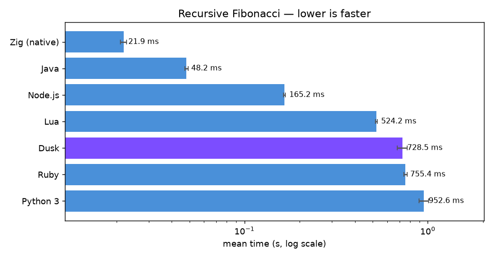

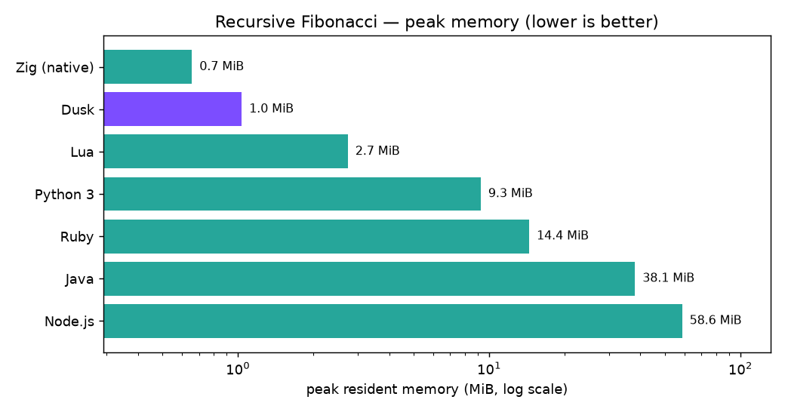

### Particle System (`particles`)

100,000 particles, 100 update passes of x += vx / y += vy; print x of the 50,000th particle.

Expected output: `50049`

| Language | Mean | Std dev | Min | Max | Relative | Peak mem |
| --- | --- | --- | --- | --- | --- | --- |
| Zig (native) | 7.3 ms | 1.2 ms | 6.2 ms | 15.5 ms | 1.00× | 3.8 MiB |
| Java | 37.5 ms | 2.1 ms | 33.6 ms | 48.6 ms | 5.13× | 44.2 MiB |
| Node.js | 171.3 ms | 3.2 ms | 164.8 ms | 177.5 ms | 23.43× | 85.7 MiB |
| Lua | 296.3 ms | 5.6 ms | 289.2 ms | 305.7 ms | 40.52× | 21.3 MiB |
| **Dusk** | **691.3 ms** | **28.4 ms** | **655.4 ms** | **724.5 ms** | **94.56×** | **16.8 MiB** |
| Ruby | 1.638 s | 72.8 ms | 1.527 s | 1.716 s | 224.02× | 30.7 MiB |
| Python 3 | 1.761 s | 74.2 ms | 1.652 s | 1.847 s | 240.86× | 34.8 MiB |

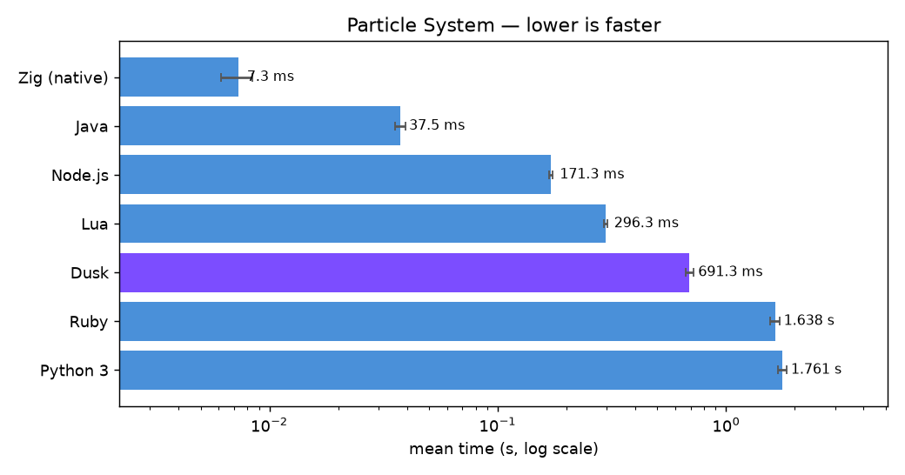

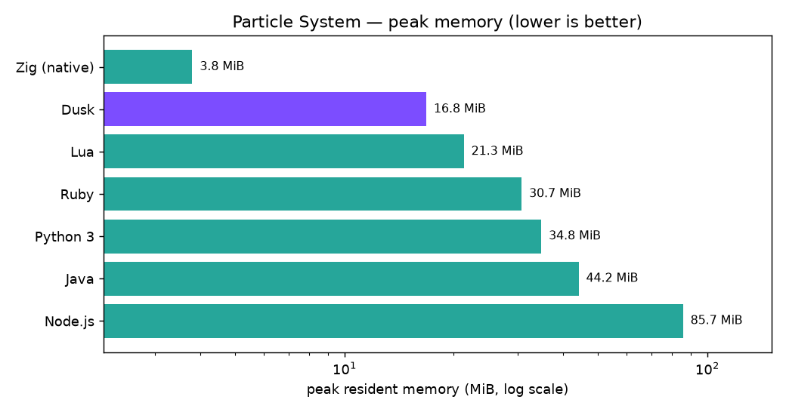

### Sieve of Eratosthenes (`primes`)

Count primes up to 100,000 using a contiguous boolean array.

Expected output: `9592`

| Language | Mean | Std dev | Min | Max | Relative | Peak mem |
| --- | --- | --- | --- | --- | --- | --- |
| Zig (native) | 791.2 µs | 80.7 µs | 653.0 µs | 2.8 ms | 1.00× | 0.8 MiB |
| Lua | 5.8 ms | 318.6 µs | 5.3 ms | 7.6 ms | 7.37× | 4.6 MiB |
| **Dusk** | **12.0 ms** | **325.9 µs** | **10.8 ms** | **13.5 ms** | **15.16×** | **3.5 MiB** |
| Java | 18.3 ms | 513.6 µs | 17.5 ms | 20.8 ms | 23.11× | 38.3 MiB |
| Python 3 | 26.2 ms | 817.4 µs | 24.8 ms | 28.9 ms | 33.12× | 10.0 MiB |
| Ruby | 52.4 ms | 1.1 ms | 50.1 ms | 55.4 ms | 66.18× | 15.2 MiB |
| Node.js | 85.3 ms | 1.5 ms | 82.7 ms | 88.8 ms | 107.80× | 59.9 MiB |

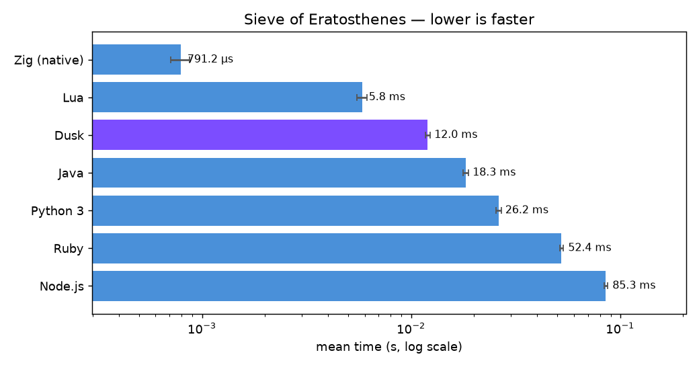

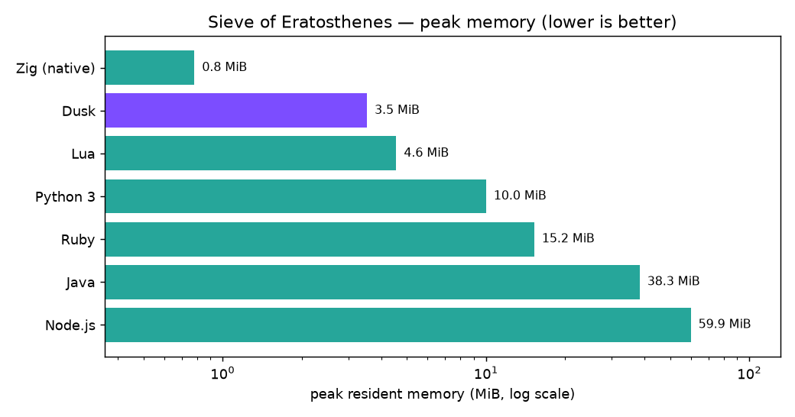

### QuickSort (`quicksort`)

Sort 10,000 descending ints in place with a hand-written, recursive middle-pivot quicksort; print value at index 5000.

Expected output: `5001`

| Language | Mean | Std dev | Min | Max | Relative | Peak mem |
| --- | --- | --- | --- | --- | --- | --- |
| Zig (native) | 727.5 µs | 74.3 µs | 603.6 µs | 2.1 ms | 1.00× | 0.7 MiB |
| Lua | 3.3 ms | 152.6 µs | 3.0 ms | 4.6 ms | 4.53× | 3.1 MiB |
| **Dusk** | **6.1 ms** | **332.6 µs** | **5.3 ms** | **7.7 ms** | **8.45×** | **1.4 MiB** |
| Python 3 | 16.2 ms | 444.7 µs | 15.5 ms | 18.1 ms | 22.26× | 9.5 MiB |
| Java | 17.9 ms | 925.6 µs | 16.4 ms | 26.4 ms | 24.56× | 38.0 MiB |
| Ruby | 46.8 ms | 940.5 µs | 45.6 ms | 50.2 ms | 64.31× | 14.6 MiB |
| Node.js | 82.2 ms | 1.4 ms | 79.6 ms | 86.1 ms | 113.01× | 58.9 MiB |

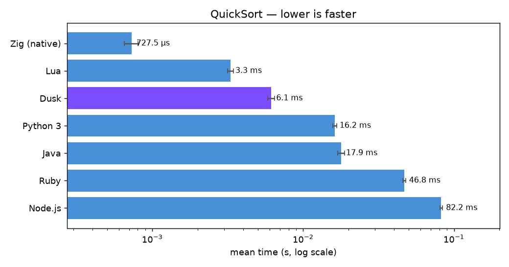

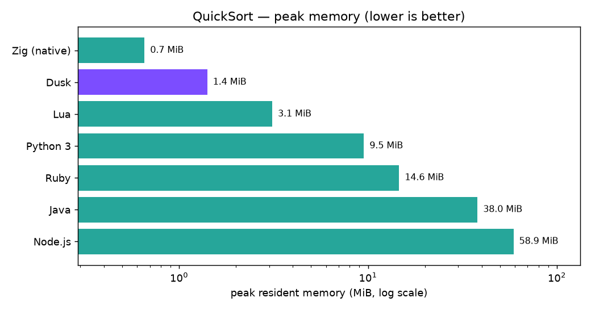

### Mandelbrot (`mandelbrot`)

800x800 grid, up to 1000 iterations per pixel (identical IEEE-754 double math everywhere); print the sum of all iteration counts as a checksum.

Expected output: `141554306`

| Language | Mean | Std dev | Min | Max | Relative | Peak mem |
| --- | --- | --- | --- | --- | --- | --- |
| Zig (native) | 347.8 ms | 1.3 ms | 344.7 ms | 349.0 ms | 1.00× | 0.7 MiB |
| Java | 374.7 ms | 8.3 ms | 361.9 ms | 390.6 ms | 1.08× | 38.6 MiB |
| Node.js | 437.1 ms | 12.1 ms | 420.7 ms | 457.8 ms | 1.26× | 60.8 MiB |
| Lua | 4.831 s | 182.7 ms | 4.554 s | 5.002 s | 13.89× | 2.8 MiB |
| Ruby | 10.409 s | 168.2 ms | 10.251 s | 10.668 s | 29.93× | 14.4 MiB |
| **Dusk** | **11.325 s** | **528.3 ms** | **10.823 s** | **12.129 s** | **32.56×** | **1.0 MiB** |
| Python 3 | 44.693 s | 3.696 s | 40.600 s | 48.980 s | 128.49× | 9.4 MiB |

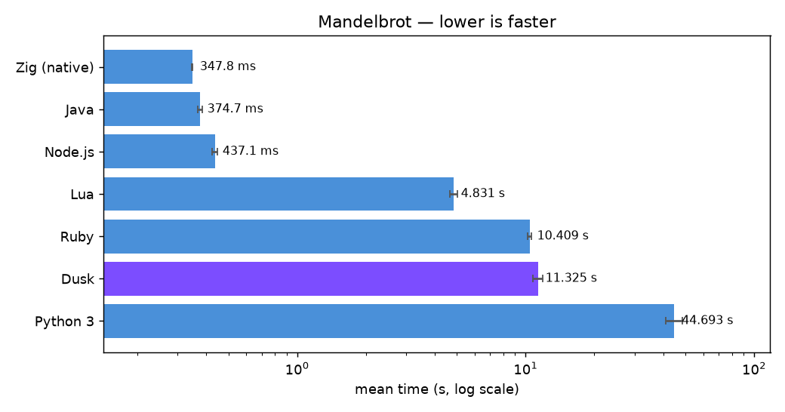

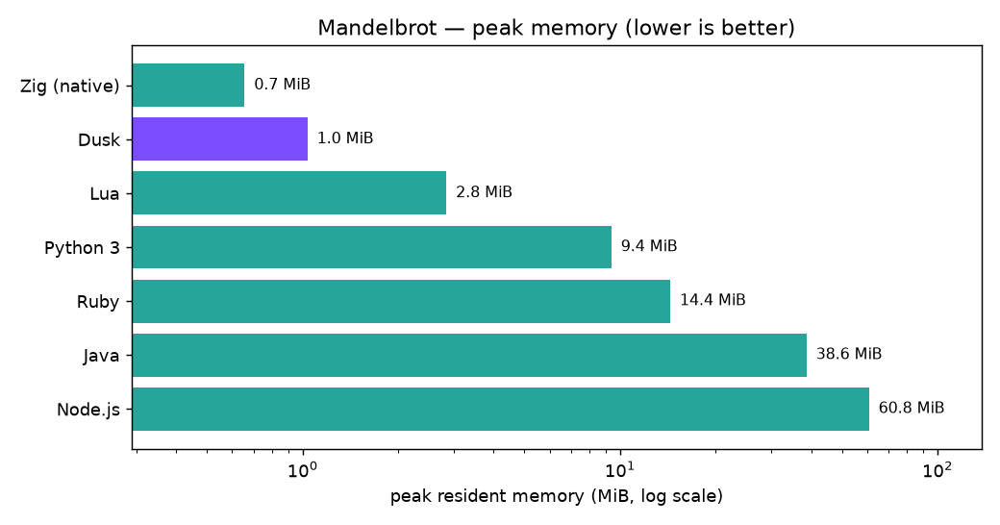

## Time summary

Slowdown of each language relative to the **Zig (native)** baseline in each benchmark (log scale).

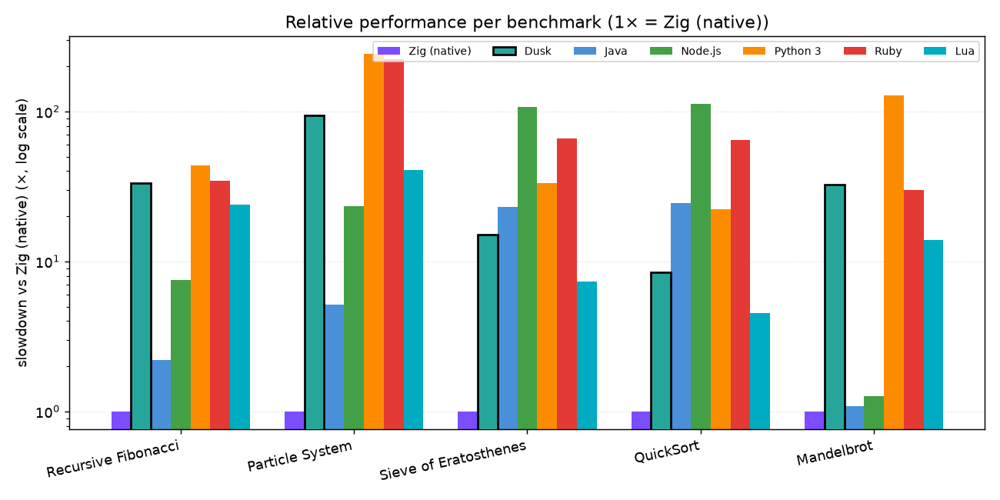

## Memory summary

Peak resident memory per benchmark (log scale).

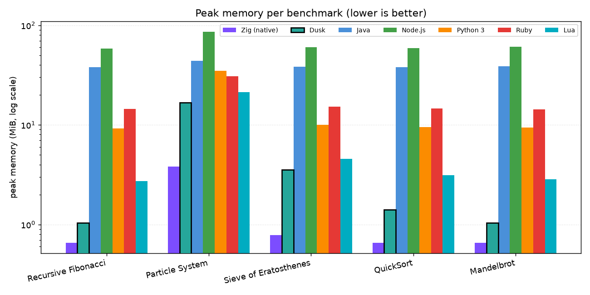
